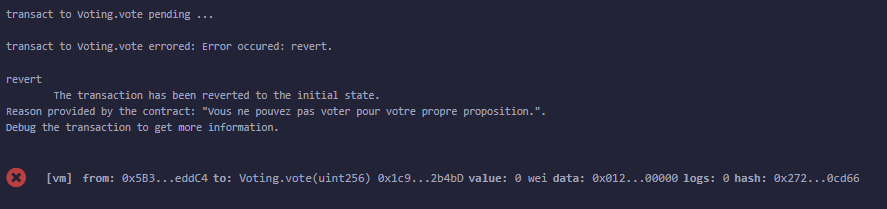

# Lien Github

https://github.com/Renan-D/voting-dapp.git

# Lien vidéo de présentation des fonctionnalités sur Remix 

https://www.youtube.com/watch?v=8xGLZjmCZIA

# Les contrats 

Les contrats sont dans le dossier smartContract/contracts

2 contrats :
- Voting.sol
- VotingToken.sol
  
# Tester le contrat sur remix 

- Rendez-vous sur https://remix.ethereum.org/
- Ajouter les contrats Voting.sol et VotingToken.sol dans le dossier contracts de remix 
- Compiler VotingToken.sol et Voting.sol dans solidity compiler de remix
- Deployer et tester les contrats dans la rubrique Deploy and run transaction de remix

Note : Il faut déployer avant VotingToken car le contrat Voting a besoin de l'adresse de VotingToken au déploiement. </br>
Il faudra également approuver le contrat Voting dans VotingToken (après avoir déployé les deux contrats)


# Fonctionnalités de base 

- Celui qui déploie le contrat devient Owner du contrat<br/>


- Inscription des électeurs : L'administrateur (Owner) peut inscrire les électeurs sur une liste blanche en utilisant leur adresse Ethereum.<br/>


- Session d'enregistrement des propositions : L'administrateur peut démarrer une session d'enregistrement des propositions.<br/>


- Enregistrement des propositions : Les électeurs inscrits peuvent soumettre leurs propositions pendant la session d'enregistrement des propositions.<br/>


- Clôture de la session d'enregistrement des propositions : L'administrateur peut mettre fin à la session d'enregistrement des propositions.<br/>


- Session de vote : L'administrateur peut lancer une session de vote.<br/>


- Consultation des propositions : Les électeurs peuvent consulter les propositions et leur ID qui seront nécesaires pour le vote (Par exemple, ici PHP : 0 , Java : 1)<br/>

  
- Vote : Les électeurs inscrits peuvent voter pour leurs propositions préférées. (avec l'id de la proposition donc ici l'électeur vote pour PHP)<br/>


- Clôture de la session de vote : L'administrateur peut mettre fin à la session de vote.<br/>


- Comptabilisation des votes : L'administrateur peut comptabiliser les votes pour déterminer la proposition gagnante.<br/>


- Consultation des résultats : Tout le monde peut consulter la proposition gagnante (Son ID ou alors sa description).<br/>


- Chaque votant peut consulter les votes des autres : On a l'adresse éthereum du votant , l'ID de la proposition pour laquelle l'électeur à voter et la date en timestamp. Evidemment le vote doit être terminé pour ne pas être influencé par les autres au moment de voter<br/>


# Fonctionnalités BONUS

- Sujet de base : Le owner peut déterminer un sujet au contrat de vote<br/>

  
- Retrait du droit de vote : L'administrateur peut retirer le droit de vote à un électeur.<br/>


- Limitation des votes : Limite le nombre de propositions pour lesquelles un électeur peut voter, afin d'éviter des votes excessifs. Un électeur peut voter que pour 1 seule proposition.<br/>


- Restriction de vote : Un électeur ne peut pas voter pour l'une de ses propres propositions. Cela permet d'éviter que tout le monde vote pour lui même<br/>


- Système de récompenses : La personne qui a soumis la proposition gagnante gagne 10 Voting token (VTK). Un token spécifique aux votes. On peut imaginer que l'organisation peut échanger ces tokens par la suite contre des avantages...
Pour cela j'ai crée un contrat VotingToken<br/>


# Front End DAPP

Malheureusement je n'ai pas de front end, j'ai tenté de faire mon front en React mais j'ai eu des complications avec des dépendances ethers etc. Finalement, j'abandonne et je prefere m'intéresser aux aux fonctionnalités supplémentaires comme la récompense du gagnant qui m'a pris pas mal de temps (Pour lire et comprendre la documentation de oppenZeppelin notamment sur ERC20) </br>

# Sample Hardhat Project

This project demonstrates a basic Hardhat use case. It comes with a sample contract, a test for that contract, and a script that deploys that contract.

Try running some of the following tasks:

```shell
npx hardhat help
npx hardhat test
REPORT_GAS=true npx hardhat test
npx hardhat node
npx hardhat run scripts/deploy.js
```
